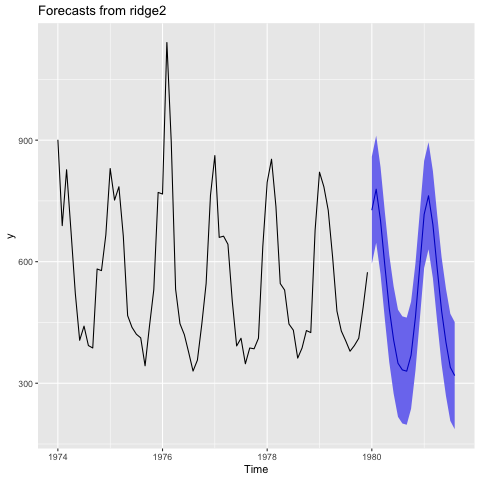
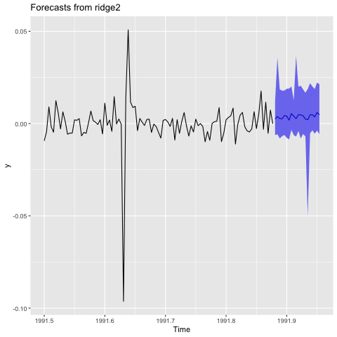
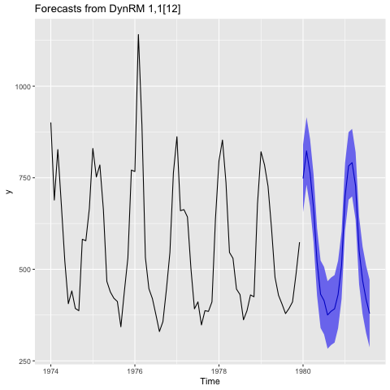
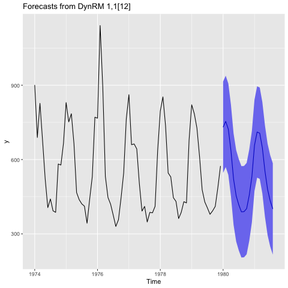
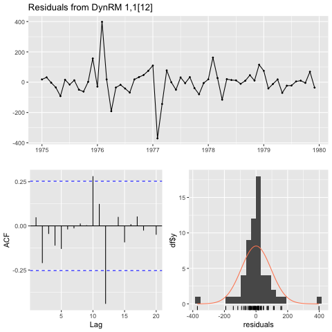
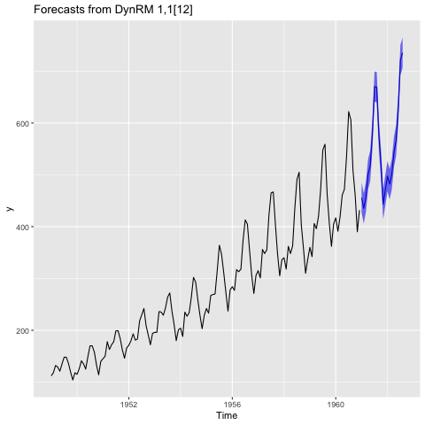
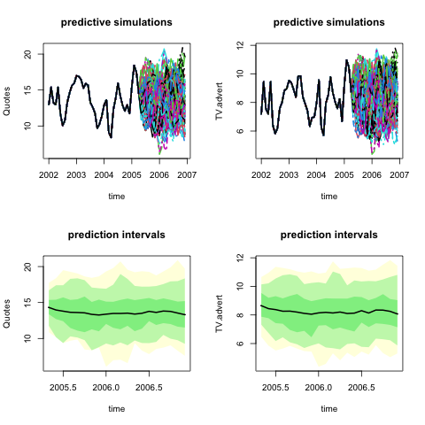

# Summary

This paper presents two original Machine Learning models implemented in the `ahead` package for forecasting univariate and multivariate time series. `dynrmf` is an autoregressive model that can utilize any Machine Learning model for forecasting univariate time series, while `ridge2f` extends ridge regression with two regularization parameters and a hidden layer for producing nonlinear outputs.

# Statement of need

Forecasting time series (MTS hereafter) is important for business planning and decision support in finance, insurance, and other industries such as *Energy* (load anticipation) and meteorology. One can obtain point forecasts from a statistical/Machine Learning (ML) model, but these point forecasts are generally of limited importance to analysts. What matters more is the model's ability to quantify the uncertainty around its predictions. 

There are multiple MTS forecasting models available in [\textsf{R} package](https://github.com/Techtonique/ahead) `ahead`'s version `0.11.0` (there are [\textsf{Python}](https://github.com/Techtonique/ahead_python) and [\textsf{Julia}](https://github.com/Techtonique/Ahead.jl) implementations, following \textsf{R}'s API as closely as possible). `ahead` itself is available through the [R-universe](https://techtonique.r-universe.dev/builds), hence allowing the package to be continuously integrated and distributed across all major operating systems.

All of `ahead`'s models include parametric prediction intervals alongside non-parametric, simulation-based uncertainty quantification techniques. This paper describes **two** of these ML models, **not available in any other statistical software**:

* \mbox{\texttt{dynrmf}}; an autoregressive dynamic model inspired by **N**eural **N**etwork **A**uto**r**egression (NNAR) ( @hyndman2013forecasting). As NNAR, \mbox{\texttt{dynrmf}} does an automatic choice of the number of autoregressive and seasonal time series lags. \mbox{\texttt{dynrmf}} is however more generic, and __can use any ML model__.

*  \mbox{\texttt{ahead::ridge2f}} (@moudiki2018multiple) implements a __quasi-randomized *neural* networks__ model extending [ridge regression](https://en.wikipedia.org/wiki/Ridge_regression) to 2 regularization parameters, and capable of producing nonlinear outputs thanks to the use of a *hidden layer*. \newline Since its first publication in 2018, \mbox{\texttt{ahead::ridge2f}} has been enhanced for integrating uncertainty quantification through the (independen/block) bootstrap (@efron1986bootstrap) and copulas' simulation(@brechmann2013modeling, @nagler2023vine). Ongoing developments include conformal prediction (@vovk2005algorithmic) and Kernel Density Estimation (@silverman2018density).

# Examples

## Install `ahead` in \textsf{R}

```r
options(repos = c(
    techtonique = 'https://techtonique.r-universe.dev',
    CRAN = 'https://cloud.r-project.org'))
utils::install.packages("rmarkdown", repos = c(CRAN="https://cloud.r-project.org"))
utils::install.packages("remotes", repos = c(CRAN="https://cloud.r-project.org"))
utils::install.packages("forecast", repos = c(CRAN="https://cloud.r-project.org"))
utils::install.packages("fpp", repos = c(CRAN="https://cloud.r-project.org"))
utils::install.packages("ggplot2", repos = c(CRAN="https://cloud.r-project.org"))
utils::install.packages("e1071", repos = c(CRAN="https://cloud.r-project.org"))
utils::install.packages("randomForest", repos = c(CRAN="https://cloud.r-project.org"))
remotes::install_github("Techtonique/ahead")
utils::install.packages("dfoptim")
```

```r
library(ahead)
library(forecast)
library(ggplot2)
library(randomForest)
library(e1071)
```

## Use `ahead::ridge2f`

### Use `ahead::ridge2f` for univariate time series forecasting

In all these examples, 5 nodes in the hidden layer and a ReLU activation function are used (default hyperparameters, see @goodfellow2016deep and @moudiki2018multiple for more details).

The `fdeaths` data set below contains **monthly deaths of females from various diseases in the UK, 1974-1979**. Here's how to obtain 20-steps-ahead forecasts for `fdeaths` with `ahead::ridge2f`; including seasonality terms. The default level for the prediction interval is equal to 95%.


```r

x <- fdeaths # input dataset
xreg <- ahead::createtrendseason(x) # add seasonality and trend
z <- ahead::ridge2f(x, xreg = xreg, h=20L) # forecasting h-steps ahead
```


```r

ggplot2::autoplot(z) # plot forecast
```
    

    

`EuStocksLogReturns` contains the daily log-returns of major European stock indices, with 1860 observations. Only the first 100 dates of the DAX index dataset are used in the example below.


```r
data(EuStockMarkets)
EuStocks <- ts(EuStockMarkets[1:100, ],
               start = start(EuStockMarkets),
               frequency = frequency(EuStockMarkets)) # original data
EuStocksLogReturns <- ahead::getreturns(EuStocks, type = "log") # obtain log-returns
res <- ahead::ridge2f(EuStocksLogReturns[, "DAX"], h = 20L,
type_pi = "movingblockbootstrap",
                        show_progress = FALSE)
```


```r
ggplot2::autoplot(res) # plot forecast
```
    

    

### Use `ahead::dynrmf` for univariate time series forecasting

`fdeaths` is used in this example too. The default model used by `ahead::dynrmf` is an automated ridge regression (automatic choice of the regularization parameter using Leave-One-Out cross-validation, see @bergmeir2018note):

**- Forecasting with `randomForest::randomForest`**

```r
# Plotting forecasts
# With Random Forest regressor, horizon of 20,
# 95% prediction interval
fit_rf <- dynrmf(fdeaths, h=20, level=95, fit_func = randomForest::randomForest,
      fit_params = list(ntree = 50), predict_func = predict)
```

```r
ggplot2::autoplot(fit_rf)
```
    

    

Check in-sample residuals:

```r
forecast::checkresiduals(fit_rf)
```

    
    	Ljung-Box test
    
    data:  Residuals from DynRM 1,1[12]
    Q* = 9.8649, df = 12, p-value = 0.6278
    
    Model df: 0.   Total lags used: 12
    
    

    

**- Forecasting with `e1071::svm`** (Support Vector Machines)


```r
# With Support Vector Machine regressor, horizon of 20,
# 95% prediction interval
fit_svm <- ahead::dynrmf(fdeaths, h=20, level=95, fit_func = e1071::svm,
fit_params = list(kernel = "linear"), predict_func = predict)
```

```r
ggplot2::autoplot(fit_svm)
```


    

Check in-sample residuals:

```r
forecast::checkresiduals(fit_svm)
```

    
    	Ljung-Box test
    
    data:  Residuals from DynRM 1,1[12]
    Q* = 27.351, df = 12, p-value = 0.006875
    
    Model df: 0.   Total lags used: 12
    

    
**- Use of an external regressor** (trend)

`AirPassengers`'s been widely tested in the specialized literature because it has a trend, a seasonality, and is heteroskedastic (non-constant variance).

```r
h <- 20L
res6 <- ahead::dynrmf(AirPassengers, xreg_fit = 1:length(AirPassengers),
                       xreg_predict = (length(AirPassengers)+1):(length(AirPassengers)+h),
                      h=h)
ggplot2::autoplot(res6)
```
    

    

### `ahead::ridge2f` for MTS forecasting

The `insurance` dataset (@hyndman2013forecasting) contains monthly quotations and television advertising expenditure for a US insurance company from January 2002 to April 2005. Fast calibration of `ahead::ridge2f` relies on generalized leave-one-out cross-validation as it will be shown in the following \textsf{R} example. It's worth mentioning that **only the 2 regularization parameters are calibrated** here. Other model's hyperparameters such as the number of time series lags or the number of nodes in the hidden layer are set to their default values (respectively `1` and `5`).


```r
objective_function <- function(xx)
{
    ahead::loocvridge2f(fpp::insurance,
                        h = 20L,
                        type_pi="blockbootstrap",
                        lambda_1=10^xx[1],
                        lambda_2=10^xx[2],
                        show_progress = FALSE,
                        )$loocv
}
start <- proc.time()[3]
(opt <- dfoptim::nmkb(fn=objective_function,
                      lower=c(-10,-10),
                      upper=c(10,10),
                      par=c(0.1, 0.1)))
print(proc.time()[3]-start)
```

**Forecasting using the _optimal_ regularization parameters**


```r
start <- proc.time()[3]
res <- ahead::ridge2f(fpp::insurance, h = 20L,
                      type_pi="blockbootstrap",
                      B = 100L, # number of predictive simulations
                      lambda_1=10^opt$par[1], # 'optimal' parameters
                      lambda_2=10^opt$par[2]) # 'optimal' parameters
print(proc.time()[3]-start)


par(mfrow=c(2, 2))
plot(res, "Quotes", type = "sims",
main = "predictive simulations")
plot(res, "TV.advert", type = "sims",
main = "predictive simulations")
plot(res, "Quotes", type = "dist",
main = "prediction intervals")
plot(res, "TV.advert", type = "dist",
main = "prediction intervals")
```
    

    
# References
